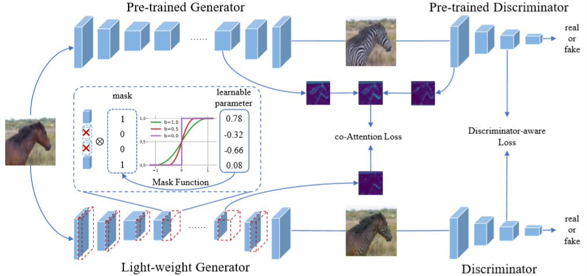

## Learning Efficient GANs using Differentiable Masks and Co-Attention Distillation ([Link](http://arxiv.org/abs/2011.08382)).

<div align=center></div>

Framework of our method. We first build a pre-trained model similar to a GAN network, upon which a differentiable mask is imposed to scale the convolutional outputs of the generator and derive a light-weight one. Then, the co-Attention of the pre-trained GAN and the outputs of the last-layer convolutions of the discriminator are distilled to stabilize the training of the light-weight model.


### Tips

Any problem, free to contact the first authors ([shaojieli@stu.xmu.edu.cn](mailto:shaojieli@stu.xmu.edu.cn)).


### Getting Started

The code has been tested using Pytorch1.5.1 and CUDA10.2 on Ubuntu 18.04.

Please type the command 

```shell
pip install -r requirements.txt
```

to install dependencies.

#### CycleGAN

- Download the Cyclcegan dataset (eg. horse2zebra)

  ```shell
  bash datasets/download_cyclegan_dataset.sh horse2zebra
  ```

- Download our pre-prepared real statistic information for computing FID, and then copy them to the root directionary of dataset.

  |     Task      |                           Download                           |
  | :-----------: | :----------------------------------------------------------: |
  |  horse2zebra  | [Link](https://drive.google.com/drive/folders/1wUGazdIe_B4gHs_gMq-jRWW53yKbyOcs?usp=sharing) |
  | summer2winter | [Link](https://drive.google.com/drive/folders/1JKJlpUDdD4TdXdwPwfdWUiF4PsXLAbto?usp=sharing) |

- Train the model using our differentiable masks (eg. horse2zebra)

  ```shell
  bash scripts/cyclegan/horse2zebra/train.sh
  ```

- Finetune the searched light-weight models with co-Attention distillation

  ```shell
  bash scripts/cyclegan/horse2zebra/finetune.sh
  ```

#### Pix2Pix

- Download the Pix2Pix dataset (eg. edges2shoes)

  ```shell
  bash datasets/download_pix2pix_dataset.sh edges2shoes-r
  ```

- Download our  pre-trained real statistic information for computing FID or  DRN-D-105 model for computing mIOU, and then copy them to the root directionary of dataset.

  |    Task     |                           Download                           |
  | :---------: | :----------------------------------------------------------: |
  | edges2shoes | [Link](https://drive.google.com/file/d/1B2iBvJWuhlYYgR5wpjMnWoDJcD4NNK-p/view?usp=sharing) |
  | cityscapes  | [Link](https://drive.google.com/file/d/1V4RmILQ0QGNQTRvMlSzN-rkvRAdmKMOr/view?usp=sharing) |

- Train the model using our differentiable masks (eg. edges2shoes)

  ```shell
  bash scripts/pix2pix/edges2shoes/train.sh
  ```

- Finetune the searched light-weight models with co-Attention distillation

  ```shell
  bash scripts/pix2pix/edges2shoes/finetune.sh
  ```

## Acknowledgements

Our code is developed based on [pytorch-CycleGAN-and-pix2pix](https://github.com/junyanz/pytorch-CycleGAN-and-pix2pix) and [GAN Compression](https://github.com/mit-han-lab/gan-compression).
